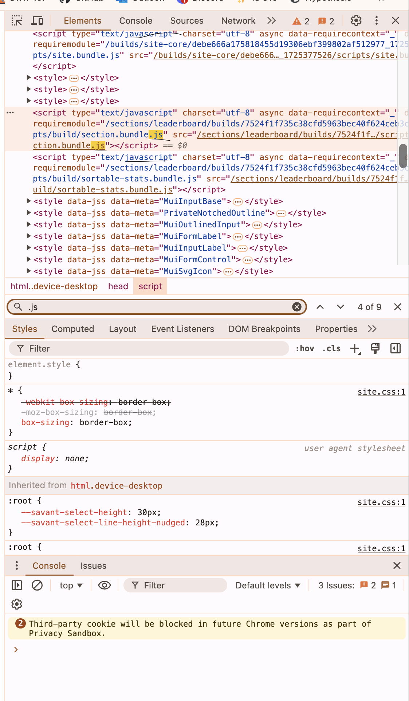
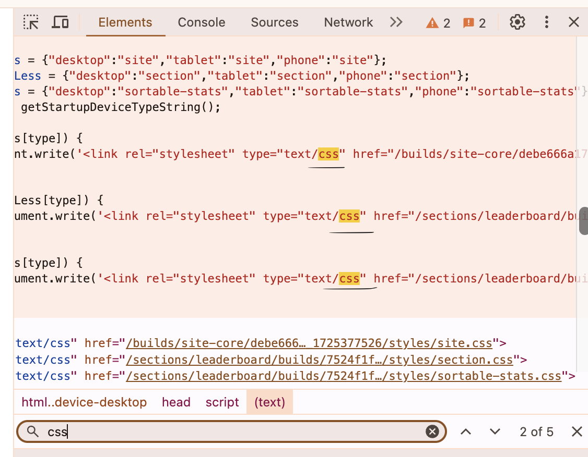
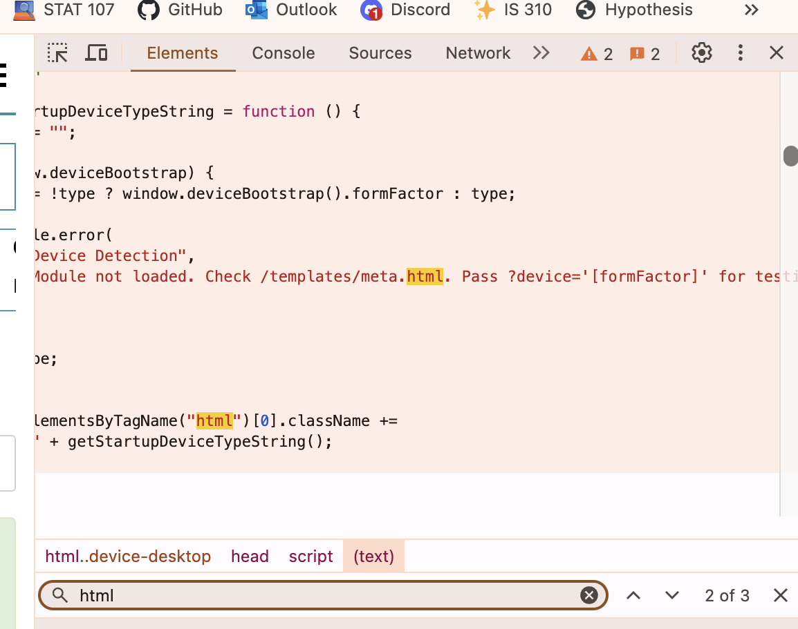
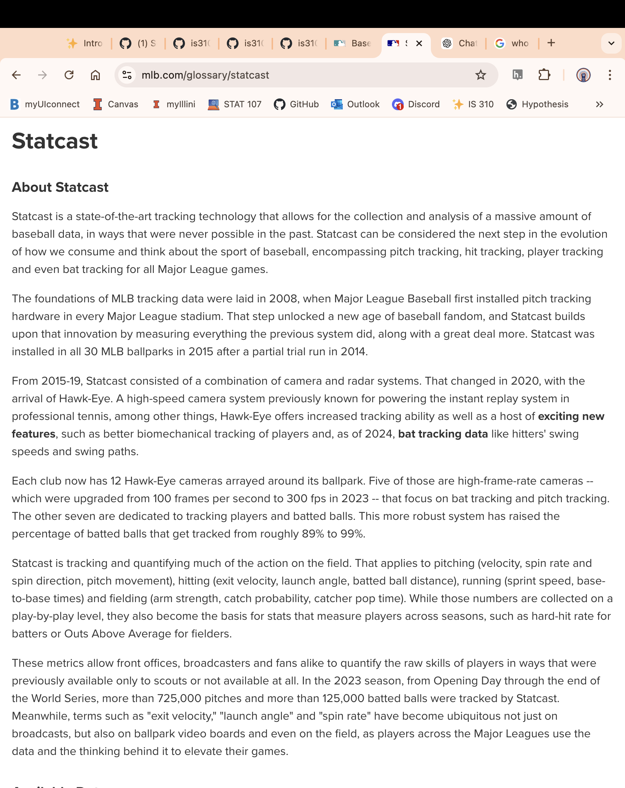

# Source and Style Assignment #1

## Website I Used: https://baseballsavant.mlb.com/ 

### Languages used:
- The website uses a combination of js, css, and html files.
-  
-  
- 

### Website Creators
- The website was developed by Major League Baseball using the Statecast system that was introduced in 2015 to all Major League ballparks, and developed by Major League Baseball Advanced Media in partnership with numerous technology companies. There is no information that states the actual names of the people that created the website.
- 